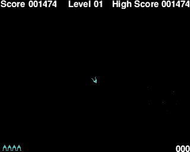

This is JohnRoids.  A simple but addictive game whose sole purpose
is to kill John.

[Play the game online.](https://www.craig-wood.com/nick/johnroids/)

I wrote this game originally in 1991 on my Acorn Archimedes to
annoy John when I was bored one rainy afternoon.  John came round and
instead of being annoyed played the game for hours and hours - there
is obviously some kind of perverse thrill in shooting oneself!

Back in 1991 digitised pictures were still something of a rarity.
I made the one of John from a camcorder video and an extremely hacky
black and white video digitiser which I built myself.  Note there are
actually two images of John - one looking happy and the other not!

The original was written entirely in ARM assembler to make it go
fast enough.  However I thought the program deserved not to wither
away so in 2001 I ported it to C and SDL and in 2018 ported it to Go
to run in the browser so many more hours can be wasted shooting at
John.

When you run the game you'll notice the playing area is rather
small (320x256 pixels).  I'm afraid this was all that was available in
1991!  I tried making the playing area bigger but the game lost some
of its visceral thrill, so you are left with a small screen.  If you
want it bigger use the zoom function of your browser.

This is an entirely faithful conversion of the original except for the
fact that I haven't put the sound back in yet.  The original samples
are in a very strange format I haven't managed to translate.

You can find the <a href="https://github.com/ncw/johnroids">source
code on github</a> - report issues and send fixes there please!

The instructions are printed on the screen to start, but to summarise
they are:

    Z      - Rotate left
    X      - Rotate right
    Shift  - Fire thruster
    Return - Fire gun
   Space  - Start the game

If you press "Toggle Keyboard" you'll get an onscreen keyboard
which works pretty well on mobile devices.

Shoot everything before it touches you. Note that you lose a point
of score for every bullet you fire. Some of the roids may shoot at you -
using thrust is a good idea at this point.  Things get very hectic
as you go through the levels.

## Installation

This repository contains 3 implementation of johnroids for SDL,
gopherjs and go/wasm.

If you want to try it locally then do

    go get github.com/ncw/johnroids/...

And run the `johnroids-sdl` binary.

Note that you'll need the SDL headers and libraries installed for this
to work.

You can [play the gopherjs and go/wasm versions
online](https://www.craig-wood.com/nick/johnroids/).

To build these versions `cd to johnroids-js` then `make build` then
`make serve`.  You may have to alter the path to your go1.11 binary in
the Makefile.

Enjoy

Nick Craig-Wood
nick@craig-wood.com
[@njcw](https://twitter.com/njcw)
2018-07-14

