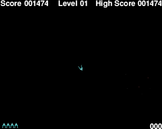

# Johnroids

This is the web versions of Johnroids implemented with both GopherJS and go/wasm.



[Play the game online.](https://www.craig-wood.com/nick/johnroids/)

[See history and instructions.](../README.md)

## How it works

The actual Johnroids game itself is implemented in the directory above this one.

The game itself exports a single object `Game` and a few constants.

```go
func New() *Game
func (g *Game) Frame() *image.Paletted
func (g *Game) KeyEvent(key KeyCode, pressed bool)
```

It is up to this code to call the `Frame` method regularly (every
20ms) display it to the user and collect key presses.

## Go in the browser

There are two methods for getting Go code running in the browser
[GopherJS](https://github.com/gopherjs/gopherjs) and go/wasm (to be in
the go1.11 release).

GopherJS is quite mature and very compatible.  Go/Wasm is not supported
by all browsers yet but shows great promise as an upcoming technology.

This game supports compiling with both GopherJS and with go/wasm (with
go1.11).

## GopherJS vs go/wasm

GopherJS and go/wasm supply almost compatible libraries to interact
with the browser.

This is abstracted in the two files

  * [gopherjs.go](https://github.com/ncw/johnroids/blob/master/johnroids-js/gopherjs.go)
  * [wasm.go](https://github.com/ncw/johnroids/blob/master/johnroids-js/wasm.go)

The most important part of these files is to abstract the representation of a Javascript object.

Firstly we use build constraints for the two files so that they only build with gopherjs or go/wasm.

GopherJS:

```go
// +build js,!wasm
```

go/wasm:

```go
// +build js,wasm
```

In GopherJS a Javascript object is a pointer to a struct, but in
go/wasm it is an opaque handle. We use the go1.9 type alias feature to
make a new type which we can use compatibly everywhere to bridge the
difference.  So in the main Johnroids code we just refer to
`jsObject` when we want a Javascript object.

GopherJS:

```go
type jsObject = *js.Object
```

go/wasm:

```go
type jsObject = js.Value
```

The other main difference between the two systems is the callback
handling when Javascript calls back into Go code.  GopherJS has the
richer callback handling system, so we have to use the lowest common
denominator between the two systems.

GopherJS:

```go
func newCallback(fn func(args []jsObject)) jsObject {
	return js.MakeFunc(func(this jsObject, args []jsObject) interface{} {
		fn(args)
		return false
	})
}
```

go/wasm:

```go
var newCallback = js.NewCallback
```

The go/wasm callback signature of `func(args []jsObject)) jsObject` is
slightly awkward to use as all the callbacks seem to start with this

```go
func(args []jsObject) {
	event := args[0]
	event.Call("preventDefault")
```


We define an `isDefined` function to smooth away the differences

GopherJS:

```go
func isUndefined(v *js.Object) bool {
	return v == nil || v == js.Undefined
}
```

go/wasm:

```go
func isUndefined(v js.Value) bool {
	return v == js.Undefined()
}
```

And a few constants and variables

GopherJS:

```go
const (
	isGopherjs = true
	isWasm     = false
	techName   = "gopherjs"
)

var (
	Global = js.Global
)
```

go/wasm:

```go
const (
	isGopherjs = false
	isWasm     = true
	techName   = "go/wasm"
)

var (
	Global      = js.Global()
)
```

The final difference to abstract away is what happens after your
`main()` exits. Programs running in the browser environment have to be
event driven so typically most will set up lots of event handlers then
exit from `main()`.  However if you exit from main with go/wasm your
code will exit whereas it won't with GopherJS.  The `run` function
abstracts this.

GopherJS:

```go
func run() {
}
```

go/wasm:

```go
func run() {
	// Wait forever
	select {}
}
```

And with that we have abstracted all the system dependent code.

## Build and run

`make build` will build with GopherJS and go-tip (you'll need to fix the path of go-tip most likely)

`make serve` will run a local webserver you can see the results on

## Performance

Times to plot the opening screen on my laptop (Intel(R) Core(TM) i7-5600U CPU @ 2.60GHz) running Linux.


|            | GopherJS | go/wasm |
|:-----------| --------:|--------:|
| Chrome 67  |  7.2 mS  | 10.1 mS |
| Firefox 60 | 10.9 mS  |  5.0 mS |

## Compatibility

The GopherJS version worked on all the browsers I tried it on whereas
the default browser on Windows 10 did not work with the go/wasm version.

## Conclusion

This shows that Go can be a good platform for game development in the
browser.

It would be possible to extract the GopherJS / go/wasm abstraction
layer into its own repository.
